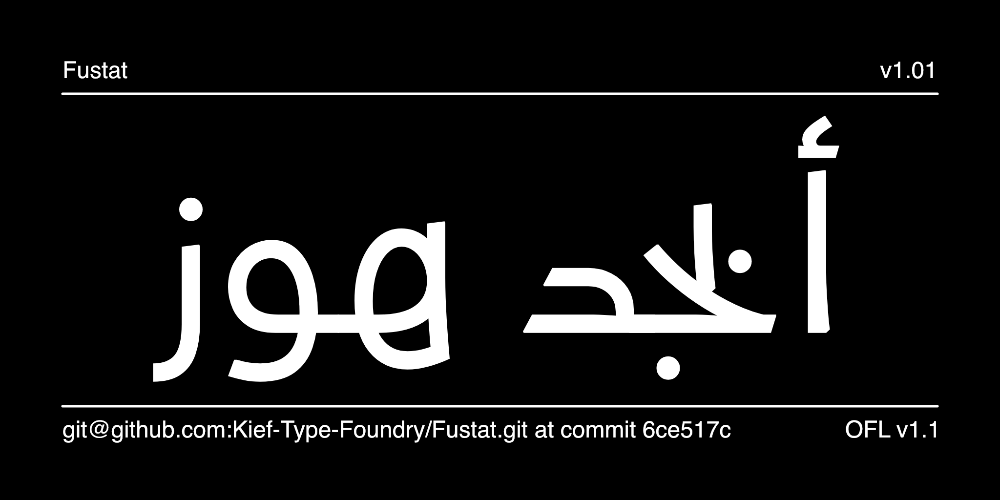

# Fustat

_Fustat_ Arabic designed by [Mohamed](https://gaber.design/) [Gaber](https://www.instagram.com/gue3bara/) and engineered by [Khaled Hosny](https://aliftype.com/), draws its inspiration from the traditional manuscript Kufi style. The typeface uniquely balances modernization with the authentic elements of Arabic script. It supports a large number of languages that use Arabic script, and includes a number of OpenType features for finer typography, including stylistic sets, proportional and tabular digits, super/subscripts, and fractions. Additionally, _Fustat_ is a variable that providing dynamic flexibility for various design applications, and includes seven pre-defined weight instances: ExtraLight, Light, Regular, Medium, SemiBold, Bold, and ExtraBold.

_Fustat_ Latin designed by [Laura Garcia Mut](https://hardtype.xyz/), was developed to match the Arabic script, implementing features and subtle details from the Arabic strokes and flows. With a mix of simple grotesque structure and other geometric forms, it is a very low-contrast sans serif family with a neutral and kind texture. With a high x-height, it works in many sizes and purposes, allowing compact consistency. It supports a Latin Extended glyph set, and includes many OpenType features and Stylistic Sets with alternate geometric forms and tailed ends, looking for a more connected feeling.

_Fustat_ is optimized for web usage, offering an authentic yet contemporary presence online. It is ideal for titles due to its distinct style, yet it also performs well in body text, ensuring readability. This makes it perfect for creating a strong, authentic brand identity with a modern twist. The typeface supports both Arabic and Latin scripts, making it versatile for bilingual design projects. Its extensive character set and the manuscript-inspired modern approach to Kufi style ensure that it meets diverse design needs.

Published under the Open Font License (OFL), _Fustat_ promotes free and open use while ensuring quality and consistency. Embrace the rich heritage of the Kufi manuscript style with the modern versatility of _Fustat_, the go-to typeface for authentic and contemporary Arabic design.

## Building

Fonts are built automatically by GitHub Actions - take a look in the "Actions" tab for the latest build.

If you want to build fonts manually on your own computer:

* `make build` will produce font files.
* `make test` will run [FontBakery](https://github.com/googlefonts/fontbakery)'s quality assurance tests.
* `make proof` will generate HTML proof files.

The proof files and QA tests are also available automatically via GitHub Actions - look at https://kief-type-foundry.github.io/Fustat.

## License

This Font Software is licensed under the SIL Open Font License, Version 1.1.
This license is available with a FAQ at
https://scripts.sil.org/OFL
